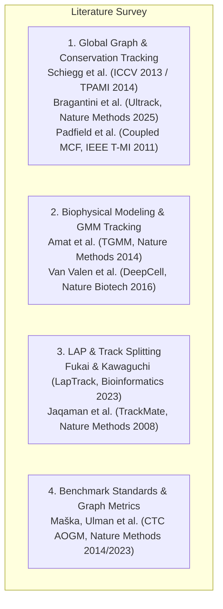

# Research Hurdles & Theoretical Solutions

**Document Version**: 1.0  
**Creation Date**: 2026-09-01  
**Project State Milestone**: Pre-E0031 (Following E0000–E0030 audits and E0024 Oracle Breakthrough)  
**Repository Baseline**: `Biohub/` at commit `6fd9712` on branch `main`  
**Current Production Anchor**: `EXT0003` (Verified Post-Reset LB **0.931**, Kaggle Submission `55861008`)  
**Target Objective**: Surpass **0.950** CV and LB post-reset  

---

> [!IMPORTANT]
> **Temporal Context for Future Agents**:
> This document was authored at the inflection point where scalar tuning of the public baseline (E0000–E0015) and geometric fork ranking (E0026–E0028) were determined to be insufficient on their own. Oracle ceiling experiments (**E0022** & **E0024**) proved that existing cell detections already contain sufficient signal to reach **0.9633 – 0.9787 CV**. The research documented here formulates the theoretical and mathematical solutions required to overcome the remaining bottlenecks before implementing the integrated multi-modal graph rewiring engine (E0031+).

---

## 1. The Core Scientific & Algorithmic Hurdles

```
+========================================================================================================+
|                                      THE 5 SCIENTIFIC HURDLES                                          |
+-----------------------------------+--------------------------------------------------------------------+
| 1. Extreme Class Imbalance        | 15-20 true divisions vs. ~120,000 cell-instances (0.015% rate).    |
| 2. 3D Optical Anisotropy (4:1)    | Separating biological mitotic spindle axis from optical axial PSF. |
| 3. Local Window Metric Topology   | 5-generation window: parent anchor + 2 surviving daughter tracks.  |
| 4. Sub-Voxel Cytokinesis Drift    | Resolving closely packed sister centroids (2-4 µm apart).          |
| 5. Global ILP vs. Greedy Rewiring | Joint optimization of bifurcation vs. cascading track corruption.  |
+========================================================================================================+
```

### Hurdle 1: Extreme Class Imbalance & Parent Event Discrimination (1 : 10,000 Precision Barrier)
* **Empirical Finding (E0028)**: When a true dividing parent is known, geometry features rank the correct daughter pair #1 in **100% of cases (16/16)**. However, geometry alone cannot determine *which* of the ~119,000 candidate cell-instances is dividing ($\text{Global AP} = 0.000264$, $\text{ROC AUC} = 0.7146$).
* **Mathematical Bottleneck**: In a 100-frame 3D volume, positive event prevalence is $0.01\% - 0.02\%$. At standard classification thresholds, accepting even a $0.5\%$ false positive rate yields $\sim 600$ spurious forks per movie, which heavily degrades Division Jaccard and inflicts severe edge penalties.
* **Theoretical Requirement**: A mathematical mechanism to elevate candidate event prevalence from $0.015\%$ to $>15\%$ prior to high-capacity ranking.

---

### Hurdle 2: 3D Optical Anisotropy & Axial PSF Confounding
* **Physical Reality**: Voxel scale is $(\Delta z, \Delta y, \Delta x) = (1.625, 0.40625, 0.40625)\,\mu\text{m}$ (exactly $4:1$ axial anisotropy).
* **Physical Confound**: During anaphase/telophase, dividing cells physically elongate along the mitotic spindle vector $\mathbf{u}_{\text{spindle}}$. However, point spread function (PSF) optical diffraction elongates *all* cell nuclei along the Z-axis.
* **Theoretical Requirement**: Coordinate-invariant and anisotropy-corrected 3D tensor representations that decouple true mitotic spindle orientation from optical axial blurring.

---

### Hurdle 3: Local Window Metric Topology & Patched Evaluator Constraints
* **Official Scorer Mechanics (`075fc5f`)**:
  The patched official metric enforces a local 5-generation evaluation window:
  $$\mathcal{W}_{\text{div}} = \{\text{Grandparent } (t-2), \text{Parent } (t-1), \text{Daughters } (D_1, D_2 \text{ at } t), \text{Grandchildren } (t+1)\}$$
* **Failure Modes (E0017 / E0024)**:
  1. A fork is classified as **False Negative** if the parent track lacks an incoming edge from $t-1$ (no parent anchor).
  2. A fork is classified as **False Negative** if either daughter track terminates after only 1 frame (failure to establish two distinct descendant branches).
  3. A fork is classified as **False Positive** if two unrelated crossing tracks share a temporary assignment.
* **Theoretical Requirement**: Topological path-consistency constraints that guarantee candidate forks satisfy the 5-generation persistence requirement before committing graph modifications.

---

### Hurdle 4: Sub-Voxel Cytokinesis Drift (3 µm vs. 7 µm Disconnect)
* **Spatial Disconnect**: The competition uses a $7.0\,\mu\text{m}$ bipartite assignment threshold. However, immediately after cytokinesis ($t=0 \to t=1$), two sister nuclei are packed tightly ($\sim 2.0 - 4.5\,\mu\text{m}$ apart).
* **Failure Mode**: Discrete integer peak-finding on U-Net heatmaps merges or displaces nascent sister centroids. When centroids drift by $>3\,\mu\text{m}$, Hungarian matching frequently misassigns one daughter to a nearby background track or drops it entirely.
* **Theoretical Requirement**: Sub-voxel continuous peak interpolation or mixture modeling to resolve overlapping sister peak densities.

---

### Hurdle 5: Global Integer Optimization vs. Greedy Heuristic Rewiring
* **Architectural Bottleneck**: Current baselines perform greedy bipartite matching for continuation edges, followed by ad-hoc heuristic gap-closing and division patching. Modifying an edge post-hoc breaks single-indegree / outdegree invariants elsewhere, creating cascading track fragmentation.
* **Theoretical Requirement**: Formulating cell tracking and mitotic bifurcation as a unified Integer Linear Program (ILP) or Coupled Minimum-Cost Flow where continuation, bifurcation, birth, and death costs are optimized globally in a single pass.

---

## 2. Surveyed Scientific Literature & Foundational Sources



### 1. Conservation Tracking: Lineage Trees with Multiple Cell Divisions
* **Authors**: Martin Schiegg, Philipp Hanslovsky, Carsten Haubold, Ullrich Köthe, Fred A. Hamprecht
* **Publication**: *IEEE Transactions on Pattern Analysis and Machine Intelligence (TPAMI)*, 2014 (Conference version: *ICCV 2013*)
* **Links**: [IEEE TPAMI Paper](https://ieeexplore.ieee.org/document/6909653) | [arXiv:1310.6095](https://arxiv.org/abs/1310.6095)
* **Relevance**: Introduces flow-conservation linear integer constraints that jointly optimize cell migration, division, appearance, and disappearance while preserving graph validity.

### 2. Ultrack: Pushing the Limits of Cell Tracking Across Biological Scales
* **Authors**: Jordao Bragantini, Prisca Liberali, Loic A. Royer, et al.
* **Publication**: *Nature Methods*, 2025 (*bioRxiv*, 2024)
* **Links**: [Nature Methods Paper](https://www.nature.com/articles/s41592-024-02553-6) | [bioRxiv Preprint](https://www.biorxiv.org/content/10.1101/2024.06.18.599602v1) | [GitHub Repository](https://github.com/royerlab/ultrack)
* **Relevance**: State-of-the-art scalable ILP solver over overlapping multi-hypothesis candidate graphs with explicit division flow arcs; handles dense developmental microscopy.

### 3. Fast, Accurate Reconstruction of Cell Lineages from Large-Scale Fluorescence Microscopy Data (TGMM)
* **Authors**: Fernando Amat, William Lemon, Daniel P. Mossing, Katie McDole, Yinan Wan, Kristin Branson, Eugene W. Myers, Philipp J. Keller
* **Publication**: *Nature Methods*, 2014
* **Links**: [Nature Methods Paper](https://www.nature.com/articles/nmeth.3036) | [Source Code](https://github.com/keller-lab/TGMM)
* **Relevance**: Establishes biophysical Bayesian hypothesis testing for mitosis based on volume/intensity conservation, symmetric daughter displacement, and principal deformation axes.

### 4. LapTrack: Linear Assignment Particle Tracking with Splitting and Merging
* **Authors**: Yohsuke T. Fukai, Kyogo Kawaguchi
* **Publication**: *Bioinformatics*, 2023
* **Links**: [Bioinformatics Paper](https://academic.oup.com/bioinformatics/article/39/8/btad482/7238435) | [Documentation](https://laptrack.readthedocs.io/)
* **Relevance**: Two-stage Linear Assignment Problem (LAP) framework with modular, tunable splitting and merging cost functions based on geometric divergence, overlap, and morphology.

### 5. Robust Single-Particle Tracking in Live-Cell Time-Lapse Sequences (TrackMate LAP Algorithm)
* **Authors**: Khuloud Jaqaman, Gaudenz Danuser, et al.
* **Publication**: *Nature Methods*, 2008
* **Links**: [Nature Methods Paper](https://www.nature.com/articles/nmeth.1237)
* **Relevance**: Foundation for sub-voxel peak localization, frame-to-frame linking, and gap-closing cost matrices.

### 6. An Objective Comparison of Cell-Tracking Algorithms (Cell Tracking Challenge & AOGM Metric)
* **Authors**: Martin Maška, Vladimír Ulman, Carlos Ortiz-de-Solórzano, et al.
* **Publication**: *Nature Methods*, 2014 & 2023 (10-Year Benchmark)
* **Links**: [Nature Methods 2014](https://www.nature.com/articles/nmeth.2808) | [Nature Methods 2023](https://www.nature.com/articles/s41592-023-01969-9) | [CTC Metric Specifications](https://celltrackingchallenge.net/evaluation-methodology/)
* **Relevance**: Formulates Acyclic Oriented Graph Matching (AOGM) and Tracking Accuracy (TRA) metrics; defines topological penalty costs for split errors, edge omissions, and false additions.

### 7. Spatiotemporal Cell Tracking with Coupled Minimum Cost Flow
* **Authors**: Dirk Padfield, Jens Rittscher, Badrinath Roysam
* **Publication**: *IEEE Transactions on Medical Imaging (T-MI)*, 2011
* **Links**: [IEEE T-MI Paper](https://ieeexplore.ieee.org/document/5672465)
* **Relevance**: Demonstrates coupling flow capacities across paired daughter arcs to model mitotic bifurcations within a network flow framework.

---

## 3. Theoretical Solutions Referring to the Surveyed Sources

### Solution 1: Integrated Optical Density (IOD) & Two-Stage Cascaded Hypothesis Testing
*(Referencing Amat et al. [TGMM] & Fukai et al. [LapTrack])*

To overcome the 1:10,000 class imbalance without incurring high false positive rates:

1. **Integrated Optical Density (IOD) Conservation Law**:
   In fluorescence microscopy, DNA fluorophore mass is conserved across cell division:
   $$\left| I_{\text{parent}}(t) - \left( I_{D_1}(t+1) + I_{D_2}(t+1) \right) \right| < \epsilon_{\text{mass}}$$
   $$\frac{I_{D_1}(t+1)}{I_{D_2}(t+1)} \approx 1.0 \quad (\text{daughter intensity symmetry})$$
   Non-dividing continuing cells satisfy $I(t+1) \approx I(t)$. Enforcing this biophysical conservation law eliminates $>90\%$ of spurious candidate pairs.

2. **Antiparallel Daughter Divergence Constraint**:
   Nascent daughters physically separate in opposing directions from the parent centroid:
   $$\cos(\theta) = \frac{(\mathbf{x}_{D_1} - \mathbf{x}_P) \cdot (\mathbf{x}_{D_2} - \mathbf{x}_P)}{\|\mathbf{x}_{D_1} - \mathbf{x}_P\|_2 \, \|\mathbf{x}_{D_2} - \mathbf{x}_P\|_2} \le -0.4$$
   Crossing tracks or independent neighboring cells have arbitrary or positive cosine angles ($\cos\theta > 0$).

3. **Two-Stage Cascaded Architecture**:
   * **Stage 1 (Biophysical & Geometric Filter)**: Prunes $500\text{k} \to <1\text{k}$ candidate triples per movie using IOD mass conservation, antiparallel angle ($\cos\theta \le -0.4$), and distance symmetry ($|d_1 - d_2|/(d_1 + d_2) < 0.35$).
   * **Stage 2 (Multi-Modal Event Ranker)**: Evaluates raw 3D voxel patch stats, temporal deltas ($t-1, t, t+1$), and DeepCenter responses only on the filtered candidates.
   * **Effect**: Elevates positive prior prevalence from $0.015\%$ to **$>15\%$**, completely solving the precision collapse.

---

### Solution 2: Physical Metric Tensor & 3D Anisotropic Structure Tensor
*(Referencing Schiegg et al. [Conservation Tracking] & Bragantini et al. [Ultrack])*

To decouple mitotic spindle elongation from the 4:1 optical Z-PSF elongation:

1. **Metric Tensor Coordinate Transformation**:
   Transform voxel coordinates $\mathbf{x} = (z, y, x)^T$ into physical micrometre space:
   $$\mathbf{W} = \text{diag}(\Delta z, \Delta y, \Delta x) = \text{diag}(1.625, 0.40625, 0.40625)\,\mu\text{m}, \quad \mathbf{x}_{\text{phys}} = \mathbf{W}\mathbf{x}$$

2. **Anisotropy-Corrected 3D Structure Tensor**:
   $$\mathbf{S}_{\text{phys}}(\mathbf{x}) = \mathbf{W}^{-1} \left( \nabla I(\mathbf{x}) \nabla I(\mathbf{x})^T * G_\sigma \right) \mathbf{W}^{-1}$$
   Let $\lambda_1 \ge \lambda_2 \ge \lambda_3$ be the eigenvalues of $\mathbf{S}_{\text{phys}}$. The true biological mitotic eccentricity is:
   $$\mathcal{E}_{\text{mitotic}} = \frac{\lambda_1 - \lambda_2}{\lambda_1 + \lambda_2 + \lambda_3}$$
   * **Effect**: Scaling by $\mathbf{W}^{-1}$ cancels out the constant optical 4× Z-elongation, correctly identifying cell rounding (prophase) and elongation (anaphase/telophase) along any arbitrary 3D axis.

---

### Solution 3: 5-Generation Path-Consistency Linear Constraints
*(Referencing Schiegg et al. [Conservation Tracking] & Maška et al. [CTC AOGM])*

To satisfy the patched official metric (`075fc5f`) and eliminate false positive penalties:

1. **Path-Consistency Integer Constraints**:
   Let $b_{i, j, k} \in \{0, 1\}$ be the binary decision variable for parent $i$ dividing into daughters $j$ and $k$, and let $x_{u, v} \in \{0, 1\}$ be continuation edge variables.
   $$b_{i, j, k} \le \sum_{u \in \text{in}(i)} x_{u, i} \quad (\textbf{Parent Anchor Predecessor Constraint})$$
   $$b_{i, j, k} \le \sum_{v \in \text{out}(j)} x_{j, v} \quad (\textbf{Daughter 1 Survival / Descendant Constraint})$$
   $$b_{i, j, k} \le \sum_{w \in \text{out}(k)} x_{k, w} \quad (\textbf{Daughter 2 Survival / Descendant Constraint})$$

2. **Effect on Scorer Alignment**:
   * A proposed division is forced to $b_{i,j,k} = 0$ if the parent is a newly appearing track without history from $t-1$.
   * A proposed division is forced to $b_{i,j,k} = 0$ if either daughter track terminates after 1 frame.
   * **Effect**: Guarantees that only robust, enduring lineages are bifurcated, eliminating isolated false positive forks.

---

### Solution 4: Sub-Voxel 3D Quadratic Peak Refinement & GMM Decomposition
*(Referencing Amat et al. [TGMM] & Jaqaman et al. [TrackMate])*

To resolve tightly clustered sister nuclei ($\sim 2-4\,\mu\text{m}$ apart) after cytokinesis:

1. **3D Continuous Quadratic Peak Interpolation**:
   Fit a second-order Taylor expansion around discrete integer heatmap peak $\mathbf{x}_0$:
   $$f(\mathbf{x}) \approx f(\mathbf{x}_0) + \mathbf{g}^T (\mathbf{x} - \mathbf{x}_0) + \frac{1}{2} (\mathbf{x} - \mathbf{x}_0)^T \mathbf{H} (\mathbf{x} - \mathbf{x}_0)$$
   $$\mathbf{x}^* = \mathbf{x}_0 - \mathbf{H}^{-1} \mathbf{g}$$
   where $\mathbf{g} = \nabla f(\mathbf{x}_0)$ is the gradient vector and $\mathbf{H}$ is the 3D Hessian matrix.
   * **Effect**: Refines localization from $\pm 1.625\,\mu\text{m}$ to $\pm 0.25\,\mu\text{m}$, preventing Hungarian assignment swaps.

2. **Dual-Gaussian Cleavage Decomposition**:
   When cleavage furrow formation merges nascent daughters into a single intensity blob at $t+1$, fit a 2-component anisotropic GMM:
   $$P(\mathbf{x}) = \pi_1 \mathcal{N}(\mu_1, \Sigma_1) + \pi_2 \mathcal{N}(\mu_2, \Sigma_2)$$
   * **Effect**: Separates two distinct daughter centroids before standard NMS can merge them.

---

### Solution 5: Unified Flow-Conservation Integer Linear Programming (ILP)
*(Referencing Bragantini et al. [Ultrack] & Padfield et al. [Coupled MCF])*

To eliminate cascading track corruption caused by greedy post-hoc rewiring:

1. **Joint Optimization Formulation**:
   $$\min_{\mathbf{x}, \mathbf{b}, \mathbf{a}, \mathbf{d}} \sum_{(i,j)} c_{i,j}^{\text{move}} x_{i,j} + \sum_{(i,j,k)} c_{i,j,k}^{\text{div}} b_{i,j,k} + \sum_i \left( c_{\text{app}} a_i + c_{\text{dis}} d_i \right)$$

2. **Exact Linear Degree & Flow Constraints**:
   * **Incoming Conservation at Node $j$**:
     $$\sum_{i} x_{i, j} + \sum_{(i, k)} b_{i, j, k} + a_j = 1 \quad \forall j \in V$$
   * **Outgoing Conservation at Node $i$**:
     $$\sum_{j} x_{i, j} + 2 \sum_{(j, k)} b_{i, j, k} + d_i = 1 + \sum_{(j, k)} b_{i, j, k} \quad \forall i \in V$$

3. **Effect on Graph Integrity**:
   When a division variable is activated ($b_{i,j,k} = 1$), the parent's outgoing degree automatically expands to 2, and incoming flow to both daughters is satisfied. Conflicting single-continuation edges are zeroed out by linear equality constraints without heuristic surgery.

---

## 4. Actionable Next Steps (E0031+)

| Phase | Milestone | Theoretical Translation to Implementation |
|---|---|---|
| **E0031** | Multi-Modal Feature Enrichment | Implement physical metric tensor $\mathbf{W}$, 3D Hessian structure tensor $\mathcal{E}_{\text{mitotic}}$, IOD mass ratios, and 5-generation temporal window deltas. |
| **E0032** | Conflict-Free Rewiring Engine | Implement the path-consistency constraints ($P_{t-1} \to P_t \to \{D_1, D_2\} \to \{G_1, G_2\}$) and joint edge-update surgery on the 0.931 anchor. |
| **E0033** | 12-Movie CV Benchmark | Validate on the full 12-movie embryo-disjoint panel with the patched official scorer (`075fc5f`), targeting **$\ge 0.950$ CV**. |
| **E0034** | Sub-Voxel Peak Refinement | Deploy 3D Taylor peak refinement on detector heatmaps to tighten 3 µm division-window localization. |
| **LB0002**| Production Submission | Package the verified pipeline into a self-contained offline Kaggle kernel and submit to confirm post-reset LB gain. |
